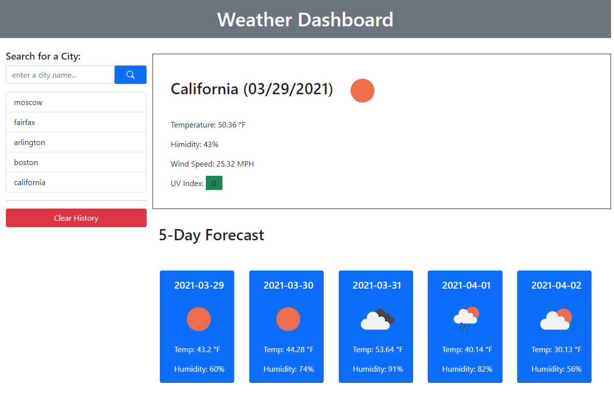
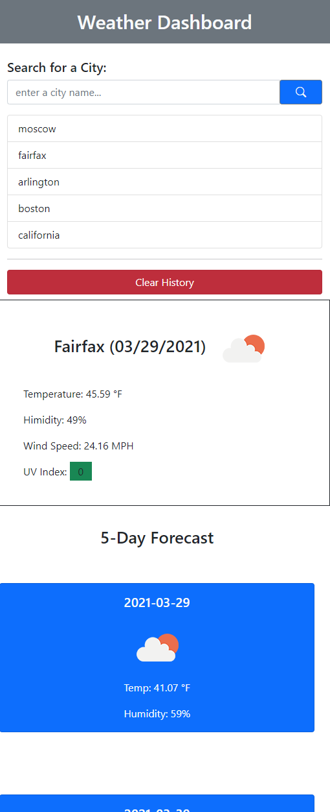

# Weather App

[Link to website...](https://kzhaanbaev.github.io/weather/)
  

App will display current and 5-Day Forecast weather for the given city name. 
If user enters wrong/invalid city name there will be a pop-up window in the form of a warning. 

All the city name will be stored in localStorage and will be displayed on left side of the page. By clicking on list items weather data will refresh based on what city name user selects from the list 

All saved list items can be removed from the view and deleted from localStorage by pressing __"Clear History"__ button.
  

  

Website is responsive. 
When width of the window reaches 992px view of the page changes, mostly taking whole row for each item.
  

